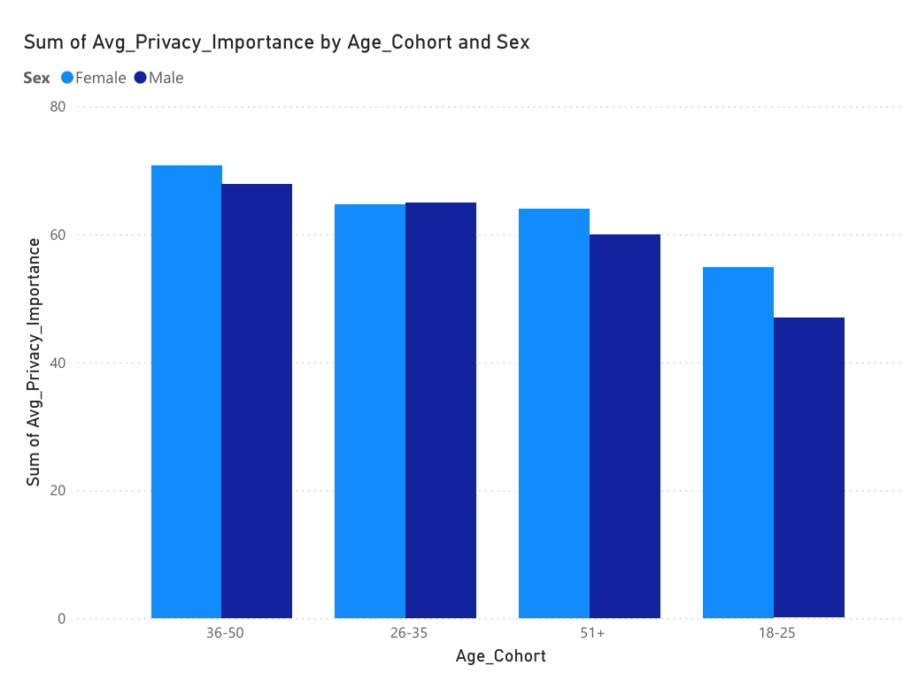

# Behavioral-Insights-into-Online-Data-Privacy-Concerns
Exploring user privacy concerns using advanced SQL techniques.

# Intoduction
This project explores public concerns over online privacy and anonymity by analyzing survey data. It provides insights into how demographics, technology usage, and political leanings influence data security perceptions and behaviors.

### Background
The project aims to answer critical questions about privacy attitudes such as:

1. Which demographic groups care most about privacy?
2. How does political conservativeness affect privacy concerns?
3. Do users who mask their identity online exhibit higher privacy worry?
4. What profiles characterize those with the highest privacy concern?

The data originates from a detailed survey on privacy perceptions and technology usage.

### Tools I Used

- **SQL:** For data cleaning, aggregation, advanced window functions, and segmentation.
- **MySQL:** Database management system for query execution.
- **Visual Studio** Code: SQL querying and editing environment.
- **Git & GitHub:** Version control and repository hosting for collaboration and portfolio display

# The Analysis
Each query investigates specific business-relevant questions:

### 1. Demographic Insights on Privacy Importance
Calculated average privacy importance by age group and sex, ranking cohorts within regions and states.

```-- Calculate Average Privacy_Importance by Age Cohort and Sex with Ranking
SELECT
  Age_Cohort,
  Sex,
  AVG(Privacy_Importance) AS Avg_Privacy_Importance,
  RANK() OVER (
    PARTITION BY Sex
    ORDER BY AVG(Privacy_Importance) DESC
  ) AS Rank_By_PrivacyImportance
FROM (
  SELECT *,
    CASE
		WHEN Age BETWEEN 18 AND 25 THEN '18-25'
        WHEN Age BETWEEN 26 AND 35 THEN '26-35'
        WHEN Age BETWEEN 36 AND 50 THEN '36-50'
        ELSE '51+'
    END AS Age_Cohort
  FROM AnonymityPoll_Clean_PrivacyImportance
) AS sub
GROUP BY Age_Cohort, Sex
ORDER BY Sex, Rank_By_PrivacyImportance;
```


*Bar graph visualizing the Privacy Importance by age cohorts and sex

**Insights**
- Middle-aged adults (especially women) are most sensitive to privacy issues.
- Younger respondents (18–25) value privacy the least on average, which matches recent academic findings that privacy concern often rises with age through young adulthood, peaks in midlife, and may decline modestly in later years.
- The gender gap is modest but present: females consistently show higher average privacy importance, potentially reflecting broader trends in privacy attitudes across populations.

### 2. Conservativeness and Privacy Concerns
Analyzed average worry about information exposure by conservativeness levels across US regions.

```-- Aggregate Worry Scores by Region and Conservativeness
SELECT 
    Region,
    Conservativeness,
    AVG(Worry_About_Info) AS avg_worry
FROM AnonymityPoll_Clean_Conservativeness_WorryInfo
WHERE Worry_About_Info IS NOT NULL
GROUP BY Region, Conservativeness
ORDER BY avg_worry;
```

| Region  | Conservativeness |avg_worry|
|---------|------------------|---------|
|South    |     	1	         |0.2222   |
|Midwest  |     	4	         |0.3455   |
|South	  |       4        	 |0.4063   |   
|Northeast|     	5	         |0.4286   |
|West     |      	5      	   |0.4444   |
|Northeast|     	3       	 |0.449    |
|Midwest  |     	2       	 |0.4545   |
|West     |     	1	         |0.4545   |
|South    |     	3       	 |0.4673   | 
|South    |     	5          |0.48     |
|Midwest  |     	3       	 |0.4912   |
|Northeast|     	1       	 |0.5      |
|Midwest  |      	1      	   |0.5      |
|West     |     	4	         |0.5156   |
|West     |      	2      	   |0.5263   |
|Midwest  |     	5        	 |0.5294   |
|Northeast|     	2     	   |0.5357   |
|South    |     	2	         |0.5882   |
|Northeast|      	4        	 |0.5926   |
|West     |     	3    	     |0.7619   |

**Insights**
- There is no simple linear relationship; average worry fluctuates with conservativeness rather than increasing or decreasing steadily.
- Some peaks appear at middle or higher conservativeness (e.g., West at 3, Northeast at 4), but not systematically across all regions.

### 3. Masking Behavior and Device Usage
Compared privacy worry between groups trying to mask identity, segmented by internet and smartphone usage.

```-- Compare Averages and Compute Difference
WITH Masker_Worry AS (
  SELECT
    Internet_Use,
    Smartphone,
    AVG(CASE WHEN Tried_Masking_Identity = 1 THEN Worry_About_Info END) AS Avg_Worry_Masker,
    AVG(CASE WHEN Tried_Masking_Identity = 0 THEN Worry_About_Info END) AS Avg_Worry_NonMasker
  FROM AnonymityPoll_Clean_MaskVsWorry
  GROUP BY Internet_Use, Smartphone
)
SELECT *,
       (Avg_Worry_Masker - Avg_Worry_NonMasker) AS Worry_Diff_Masker_vs_NonMasker
FROM Masker_Worry;
```

| Internet_Use | Smartphone | Avg_Worry_Masker | Avg_Worry_NonMasker | Worry_Diff_Masker_vs_NonMasker |
|--------------|------------|------------------|---------------------|--------------------------------|
|       1      |   	0     	|     0.5758       |	     0.4675  	     |             0.1083             |
|       0	     |    1       |   	0            |      	0.2          |            	-0.2              |
|       1      |  	1       |  	  0.6739       |    	 0.4667     	 |             0.2072             |             

**Insights**
- The highest privacy worry is found among those who use both internet and smartphone and who mask their identity (0.674).
- Among those who only use smartphones (Internet_Use=0, Smartphone=1), non-maskers have slightly higher average worry (0.20) than maskers (0.00).
- This suggests masking is much less common/effective or not a meaningful signal for privacy concern in smartphone-only users.

### 4. Profiling Top Privacy Concerned Users
Identified the top 10% most privacy-conscious individuals and profiled their masking behavior.

```WITH RankedData AS (
    SELECT *,
           NTILE(10) OVER (ORDER BY Privacy_Importance DESC) AS privacy_group
    FROM AnonymityPoll
    WHERE Privacy_Importance IS NOT NULL
)
SELECT 
    'Top 10%' AS group_label,
    CASE WHEN Tried_Masking_Identity = 1 THEN 'Yes' ELSE 'No' END AS masks_identity,
    COUNT(*) AS count,
    ROUND(COUNT(*) * 100.0 / SUM(COUNT(*)) OVER (), 1) AS pct_within_group
FROM RankedData
WHERE privacy_group = 1
GROUP BY masks_identity

UNION ALL

SELECT 
    'Other 90%' AS group_label,
    CASE WHEN Tried_Masking_Identity = 1 THEN 'Yes' ELSE 'No' END AS masks_identity,
    COUNT(*) AS count,
    ROUND(COUNT(*) * 100.0 / SUM(COUNT(*)) OVER (), 1) AS pct_within_group
FROM RankedData
WHERE privacy_group != 1
GROUP BY masks_identity;
``` 

| group_label |	masks_identity |  count  | pct_within_group |
|-------------|----------------|---------|------------------|
|  Top 10%    |       No	     |    68	 |       86.1       |
|  Top 10%    |    	  Yes      |    11	 |       13.9       |
| Other 90%   |       No       |  	591	 |       83.5       |
| Other 90%	  |       Yes      |    117	 |       16.5       |

**Insights**
- Unexpectedly, masking identity is actually a bit less common in the top 10% compared to the rest (13.9% vs. 16.5%).
- This suggests that extreme concern about privacy does not guarantee more masking behavior.
- Overall, masking identity is a minority behavior (only about 15% across all users).

# Conclusion

1. **Demographic Insights:** Privacy concern is highest among middle-aged adults, particularly women, with younger groups showing lower awareness, indicating targeted privacy outreach is needed.
2. **Conservativeness & Region:** Privacy worries vary by political leanings and region, requiring nuanced, location-specific privacy communication strategies.
3. **Masking & Device Usage:** Masking behavior correlates with higher privacy concern mainly among users with both internet and smartphone access; smartphone-only users show weaker linkage, highlighting education gaps in that segment.
4. **Top Privacy Concern Profiles:** The highest privacy-concerned group does not consistently engage more in masking behavior, suggesting privacy concern alone isn’t enough to drive protective action, and barriers to behavior change must be addressed.